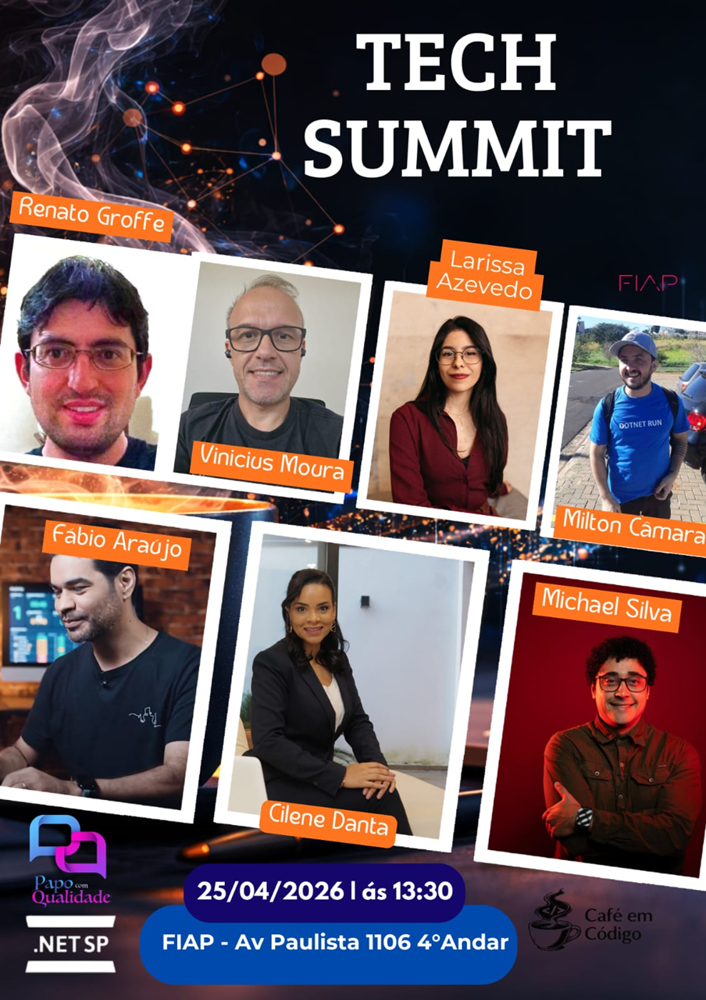
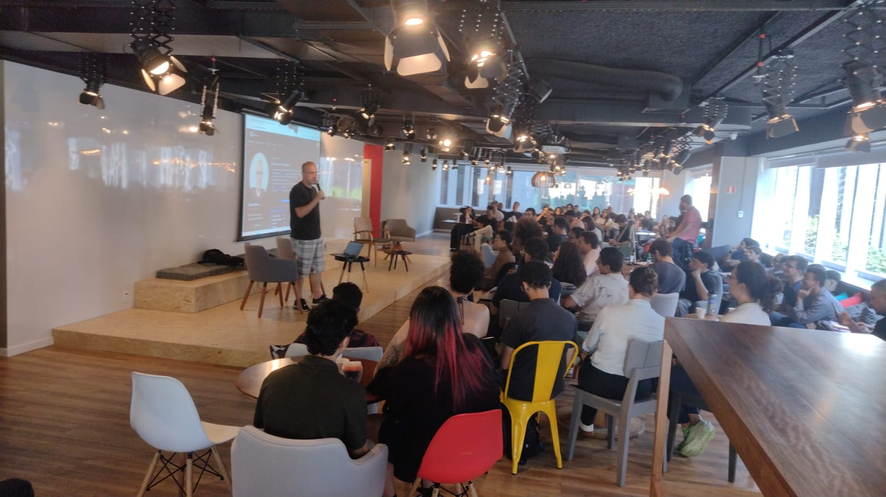
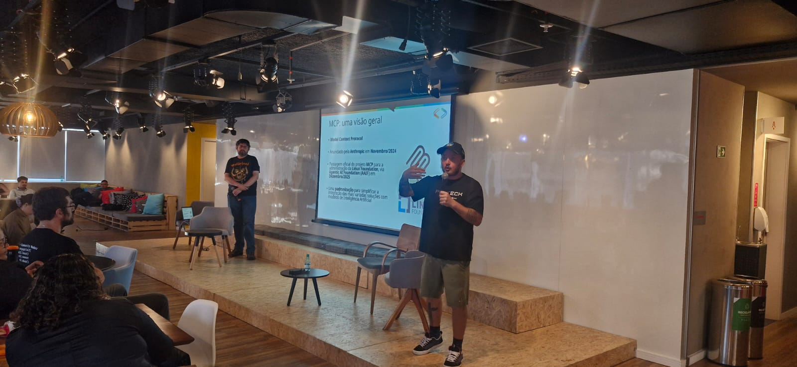
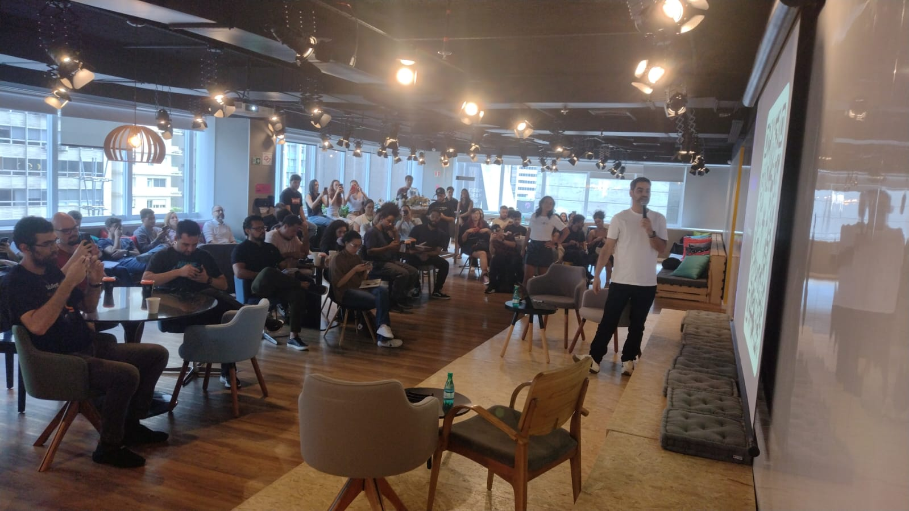
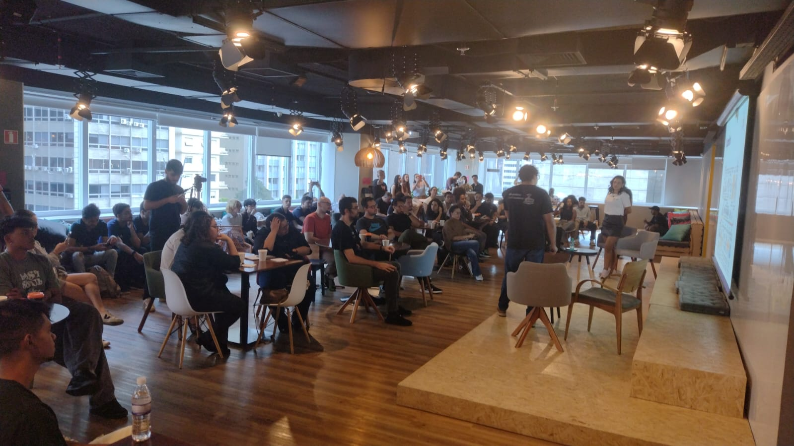
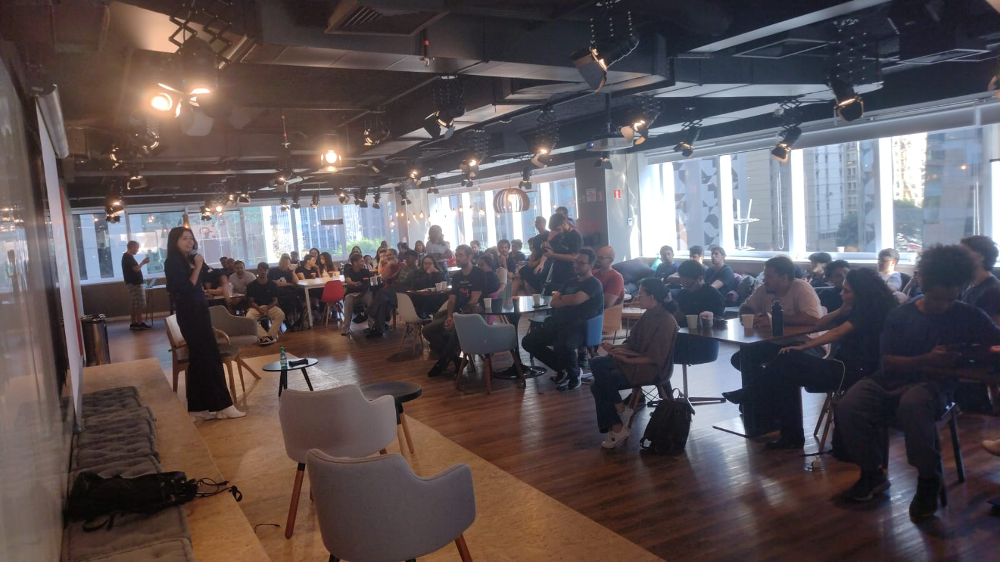
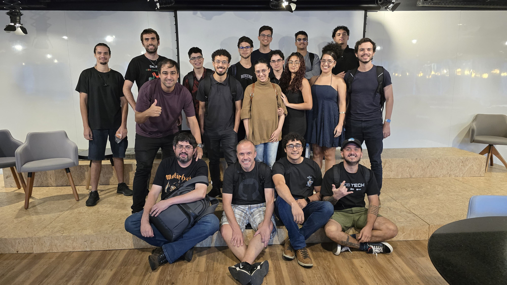
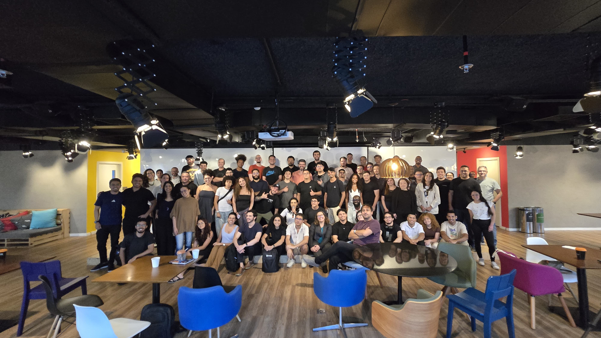

# tech-summit-2026-04
Photos and general information about the "Tech Summit" event, held in the city of São Paulo, Brazil.

Date: **04/25/2026 (Saturday)**

Organizers:
- **Cilene Danta (Café em Código)**
- **Michael Silva (Café em Código)**
- **Renato Groffe (Microsoft MVP, Docker Captain, Grafana Champion, APIsec U Ambassador, MTAC)**
- **Fábio Araújo (QA Lead, Dev Referências)**

Number of attendees: **100 people**

---

Presentations/talks that took place during the event:

_# MCP + Playwright: how to build smarter tests_

Speaker: **Fábio Araújo (QA Lead, Dev Referências)**

Technologies and topics covered: **Playwright, LLMs, Artificial Intelligence, MCP, Software Testing, Software Quality, Productivity...**

_# More AI, less leadership: the risk nobody is talking about_

Speakers: **Cilene Danta (Café em Código), Michael Silva (Café em Código)**

Technologies and topics covered: **Artificial Intelligence, LLMs, Productivity, Leadership, Software Development, IT Career...**

_# GitHub Agentic Workflows: automate everything you need_

Speaker: **Vinicius Moura (Microsoft MVP)**

Technologies and topics covered: **GitHub, GitHub Actions, GitHub Copilot, Artificial Intelligence, DevOps, LLMs, AI Agents, MCP, .NET, C#, ASP.NET Core, Minimal APIs, Docker, Containers, Microsoft Azure, Azure Container Apps...**

_# Career tips for Devs to be irreplaceable in the AI era_

Speaker: **Larissa Azevedo (Microsoft MVP)**

Technologies and topics covered: **Artificial Intelligence, LLMs, Software Development, IT Career, Web Development...**

_# How can GitHub Copilot + MCPs be useful for the initial setup and documentation of new applications?_

Speakers: **Renato Groffe (Microsoft MVP, Docker Captain, Grafana Champion, APIsec U Ambassador MTAC), Milton Camara Gomes (Microsoft MVP, MTAC)**

Technologies and topics covered: **GitHub, GitHub Actions, GitHub Copilot, Artificial Intelligence, DevOps, LLMs, AI Agents, MCP, .NET, C#, ASP.NET Core, Minimal APIs, Docker, Containers, Docker Compose, Grafana, Grafana Tempo, OpenTelemetry...**

---

Access this [**link**](/img/) to view all photos from the presentations.

This event was a partnership between the communities [**Café em Código**](https://www.linkedin.com/company/caf%C3%A9-em-c%C3%B3digo-engenharia-carreira-lideran%C3%A7a-tech/), [**.NET SP**](https://www.meetup.com/dotnet-Sao-Paulo/) and [**FIAP Pós Tech**](https://postech.fiap.com.br/).

Registration form: [**Sympla**](https://www.sympla.com.br/evento/tech-summit-ia-github-testes-lideranca-carreira-gratuito-e-presencial-sao-paulo-sp/3380344)

Venue: **FIAP - Avenida Paulista, 1106 - 4th floor - Bela Vista - São Paulo/SP**

---

